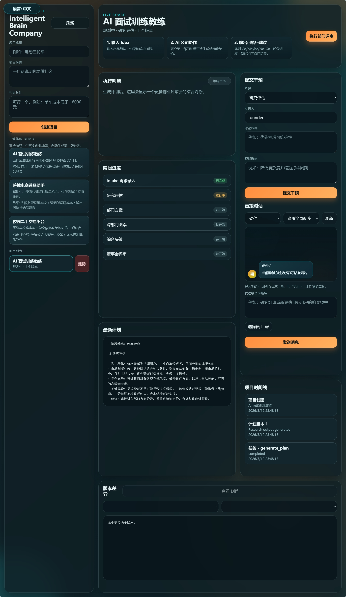
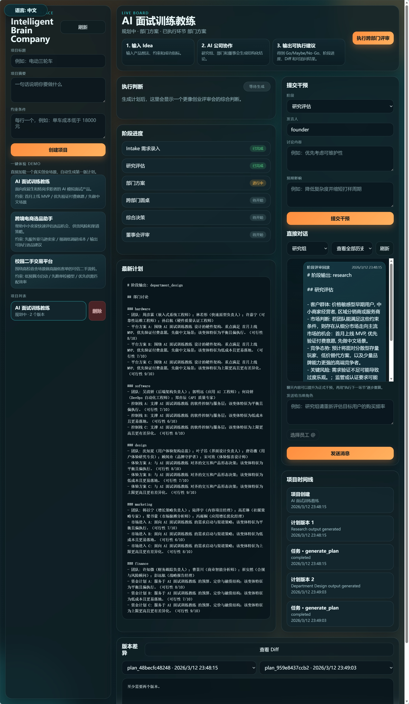
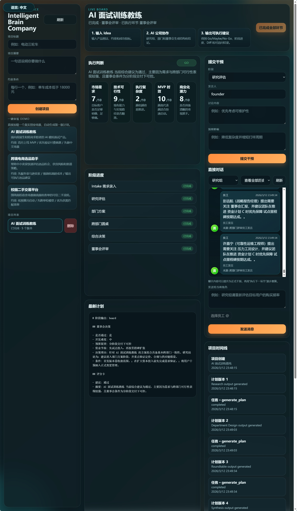

# Intelligent Brain Company

> 一个用于压力测试创业想法的 AI 董事会系统：它会像一家真实公司一样，进行研究、部门评审、董事会辩论、评分卡打分，以及基于问题的重规划。

[English Version](./README.md)

---

## 项目演示

> 请把下面图片链接替换成你的 GIF 或短视频预览图。


**给它一个创业想法。**  
它会像一个 AI 公司一样运行完整评审流程：

- 做市场和背景研究
- 让不同“部门”分别提出意见
- 进入董事会层面的审查和讨论
- 输出结构化评分卡
- 在发现重大问题后提出重规划 / 转向建议

它不是只给你一个“AI 回答”，而是给你一个**更接近真实公司内部决策流程**的结果。

---

## 为什么要做这个项目

很多创业项目失败，不是因为团队做得不够快，  
而是因为他们在一开始没有把想法挑战得足够彻底。

Intelligent Brain Company 想解决的是这个问题：

- **先研究，再兴奋**
- **先辩论，再投入**
- **先评分，再乐观**
- **先干预，再执行**

这个项目的核心目标很简单：

**在你投入几周甚至几个月之前，先把创业想法压测一遍。**

---

## 它和普通 AI 聊天机器人有什么不同？

普通 AI 往往会给你一个看起来聪明的回答。

这个项目想做的不是“更会回答”，  
而是“更像一个组织在做判断”。

### 普通聊天式方式通常是：
- 一个提示词
- 一次回复
- 一个比较模糊的建议

### 而这个系统希望提供的是：
- 研究与问题框定
- 多部门视角评审
- 董事会式决策
- 结构化评分卡
- 干预机制
- 重规划 / pivot 建议

所以它更像是：

**把你的创业 idea 扔进一家 AI 公司内部跑一遍。**

---

## 工作流程

具体实现可以不断迭代，但整体产品逻辑大致如下：

1. **想法输入（Idea Intake）**  
   用户提交一个创业想法。

2. **研究阶段（Research Phase）**  
   系统先建立背景认知，包括市场、竞争、机会、风险、可行性等。

3. **部门评审（Department Review）**  
   不同 AI 角色 / 部门从不同角度分析这个想法。

   例如：
   - 市场 / 研究
   - 产品
   - 财务
   - 增长 / GTM
   - 战略
   - 风险 / Red Team

4. **董事会评审（Board Review）**  
   将问题升级到更高层级的判断流程，模拟公司治理式审查。

5. **评分卡（Scorecards）**  
   从多个维度给项目打分，例如：
   - 市场吸引力
   - 执行难度
   - 护城河 / 防御性
   - 商业化能力
   - 时机
   - 风险水平

6. **干预驱动重规划（Intervention-Driven Replanning）**  
   如果发现重大缺陷，系统不只是“否掉”，还会尝试给出缩小范围、重新定位或 pivot 的建议。

---

## 示例场景

**输入想法：**  
> “一个服务于首次单干创业者的 AI 联合创始人。”

系统可能会输出：
- 市场风险
- 执行风险
- 用户定位不清
- 定价薄弱
- GTM 问题
- 重定位建议
- go / no-go / pivot 风格的董事会结论

这个项目不是为了制造“看起来很厉害”的热闹，  
而是为了制造**真正有用的压力测试**。

---

## 截图展示

> 请把下面占位图替换成你真实的产品截图。

### 1. 创业想法输入与流程开始


### 2. 多部门评审 / 多智能体分析


### 3. 董事会结论、评分卡与重规划结果


---

## 核心概念

### Research
在判断一个创业想法之前，先建立上下文和背景信息。

### Departments
通过多个“部门”从不同视角提出意见，而不是把所有判断压缩成一句话。

### Board Review
引入董事会层级，让系统更像真实组织里的治理与决策流程。

### Scorecards
结构化评分可以让不同 idea 之间更容易比较，也更容易复盘和优化。

### Intervention-Driven Replanning
系统不仅要指出问题，还要帮助用户重新设计方向。

---

## 适合谁使用

这个项目可能适合：

- 正在验证创业点子的创始人
- 在探索新产品的独立开发者
- 想做机会评估的产品团队
- 创业加速器 / 创业训练营
- 做早期初筛的投资人
- 想用更结构化方式评估想法的人

---

## 可以解决的问题

- **这个 idea 值不值得做？**
- **它最大的问题是什么？**
- **如果董事会来审，会卡在哪？**
- **商业模式哪里最弱？**
- **如果要 pivot，应该往哪边转？**
- **怎么让这个项目更可投 / 更可行？**

---

## 这个项目有意思的地方

它结合了几个方向：

- AI agents
- 创业 idea 评估
- 结构化决策系统
- 公司流程仿真
- 类人组织治理工作流

它不是单纯地回答问题，  
而是在尝试模拟一种**组织化思考过程**。

---

## 架构说明

> 你后面可以在这里补充真实的技术架构细节。

建议后续补充：
- 编排流程
- agent / role 设计
- 模型使用方式
- 状态管理
- 评分逻辑
- 重规划触发条件
- 输出报告生成方式

### 示例架构方向
- Frontend：提交 idea 与展示评审流程的界面
- Backend：多步骤评估编排引擎
- LLM 层：不同部门 / 角色的推理与分析
- Evaluation 层：评分卡与董事会决策逻辑
- Replanning 层：干预与转向建议生成

---

## 本地运行

> 请将这里替换成你真实的安装与运行说明。

### 依赖要求
- Python
- Node.js / npm
- 可能需要的 API Key 与环境变量

### 示例安装
```bash
git clone https://github.com/MenJW/Intelligent-Brain-Company.git
cd Intelligent-Brain-Company
# 安装后端依赖
# 安装前端依赖
# 配置环境变量
# 启动项目
```

---

## Roadmap

- [ ] 提升各部门角色的专业化程度
- [ ] 增强董事会辩论机制
- [ ] 丰富评分卡维度
- [ ] 增加对未来 6–12 个月创业结果的情景模拟
- [ ] 支持导出 board memo / investment memo
- [ ] 优化可视化报告
- [ ] 提供在线公开试玩版

---

## 建议尝试的 Demo 想法

如果你想快速展示这个系统，可以先试这些 idea：

- “面向内容创作者的 AI 税务助手”
- “服务独立健身房的垂直 SaaS”
- “给单干创业者用的 AI 产品经理”
- “创业公司分时运营人才 marketplace”
- “给 Shopify 品牌的 AI 客服副驾驶”

你也可以故意输入一些很差的 idea，看看系统会怎么反应。

---

## 项目理念

好的创业想法，应该经得住压力。

这个项目背后的一个简单信念是：

**在你真的创建一家公司之前，先让你的想法在一家 AI 公司里活下来。**

---

## 欢迎贡献

欢迎任何形式的反馈、批评、实验和贡献。

如果你对下面这些方向有想法：
- 更好的评估逻辑
- 更好的部门设计
- 更好的评分卡
- 更好的仿真机制
- 更好的创业想法压力测试方式

欢迎提 issue 或提交 PR。

---

## License

> 请在这里补充你的许可证信息。
