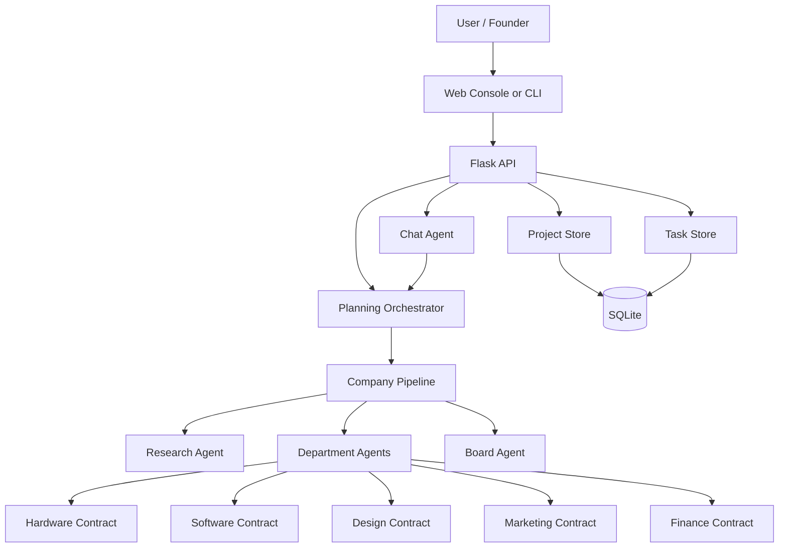

# Architecture

Intelligent Brain Company is designed as a product workflow rather than a prompt bundle. The key architectural choice is explicit state plus explicit organizational stages.

## System Diagram

## Layer Breakdown

### Interface Layer

- Web console for demo-first interaction
- CLI for quick local generation
- HTTP API for programmatic control and future integrations

### Service Layer

- Planning orchestrator builds plans and renders markdown
- Chat agent handles direct conversation with departments and board
- Storage services persist projects, tasks, versions, and chats

### Workflow Layer

- Research
- Department planning
- Roundtable review
- Synthesis
- Board decision
- User intervention and recomputation

### Domain Layer

- Idea brief
- Department solution
- Board decision
- Plan scorecard
- Project record and plan versions

## Why This Matters

This architecture gives the product three advantages over a single-prompt system:

1. State survives across conversations and revisions.
2. Department outputs can be validated against typed contracts.
3. Human interventions can become durable change events instead of ad hoc reprompts.

## Current Deployment Shape

- Local development: Flask app via ibc-api
- Online demo: Render via render.yaml and gunicorn
- Persistence: SQLite for single-instance demo stability

## Next Architecture Upgrades

1. Auth and workspace-level separation
2. Managed database for multi-user deployment
3. Checkpoint-aware recomputation instead of full downstream reruns
4. Evaluation dataset and automated quality regression checks